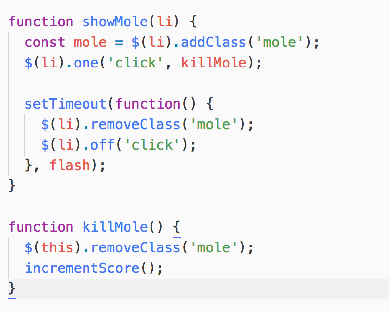
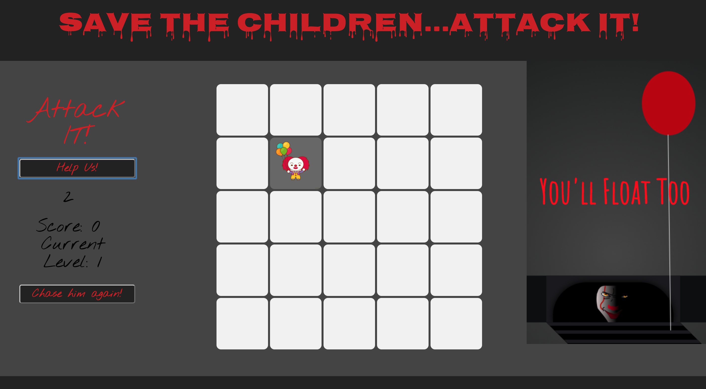

# WDI_PROJECT_1

## Description

"Save the Children...Attack IT!" - themed whack-a-mole game. Chosen to consolidate topics covered in previous two weeks.

## Tech used / Stack

- HTML
- CSS
- Javascript
- JQuery

## Approach

Initial planning involved time scales expected to cover;

- initial basic game logic
- expansion to main game with level up feature(s)
- page layout
- final styling

## Coding Highlights
- at this stage, writing code in one method and then restructuring in alternative methods to incorporate and dry up flow of the code was useful
- generating random li and adding click event for set timeout

Figure 1: Interface with DOM

- removing click events from the DOM and simultaneously timing out click events

## Challenges

- deviating from original pseudocode plan to spend time on more difficult game logic which was not required, however, learned to let that code go and focus on the simplicity of the game in order to introduce a valid level up strategy to make the game more difficult by increasing speed
- originally planned for a softball themed game as I play softball, however, realised later that for user experience, the quirks which mimicked the game play rules of softball would not be obvious to general user so switched to basic theme for styling based around Halloween season
- understanding the browser size when using inspector tools
- cursor change when click event occurred was not resolved, possibly due to image size/type 

## Improvements

- due to time constraints, CSS requires a revisit to ensure cleaner presentation for ease of redoing layout if required

Figure 2: Image during Play Mode

- add animation and possibly work on own graphics in a design package
- resolve cursor change issue and include audio attached to this event

## Acknowledgements

- Pennywise the clown image from "Pennywise IT" - pen by Beatrize Agustin
- IT - Music from the Trailer - 2017 - you tube posted by Emotional Beats
